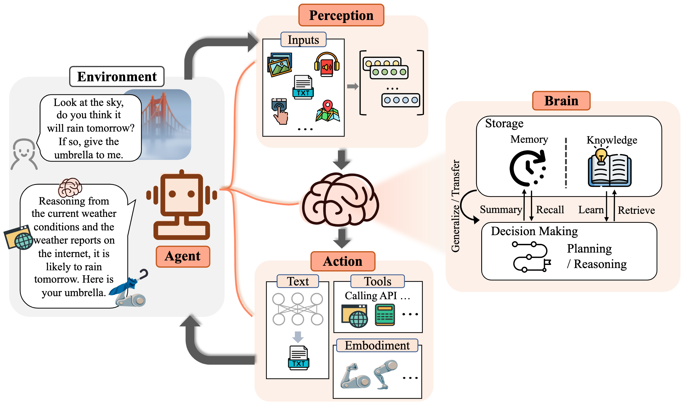
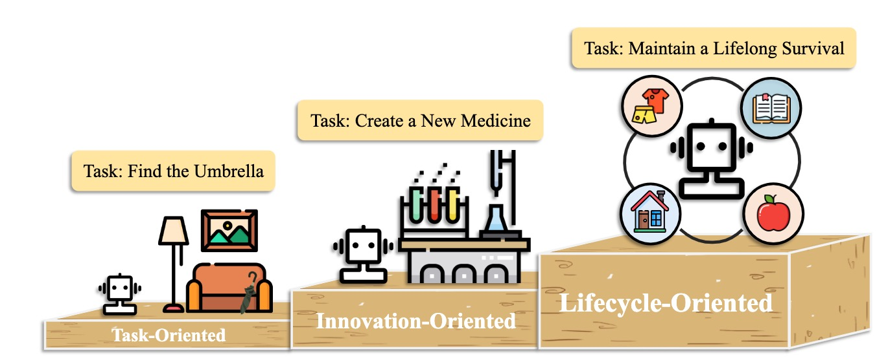
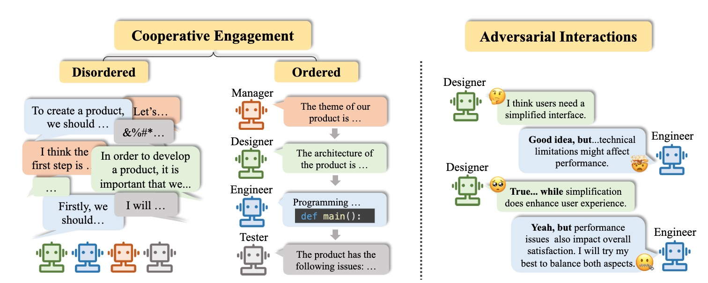
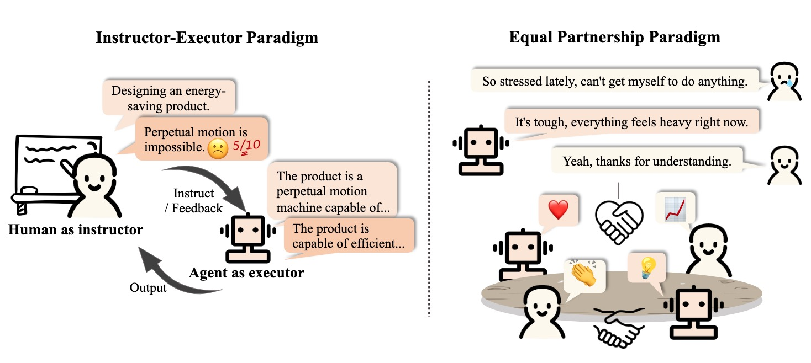

# Exploring the Core of LLM-Based Agents: Background, Construction, and Applications

This repository serves as a literature review for the 86-page paper "The Rise and Potential of Large Language Model Based Agents: A Survey" by Zhiheng Xi et al.

:link: https://arxiv.org/abs/2309.07864

## Table of Contents  
1. [Overview](#Overview)  
2. [The Birth of An Agent](#the-birth-of-an-agent)
   - [Brain - The Core](#brain---the-core)
   - [Perception - The Senses](#perception---the-senses)
   - [Action - Interaction with the World](#action---interaction-with-the-world)
3. [Agents in Practice](#agents-in-practice) 
   - [Single-Agent Applications](#single-Agent-Applications)
   - [Coordinating Potential of Multiple Agents](#Coordinating-Potential-of-Multiple-Agents)
   - [Interactive Engagement between Human and Agent](#Interactive-Engagement-between-Human-and-Agent)
4. [Critical Analysis](#critical-analysis)
5. [Video Recording](#video-recording)
6. [Citation](#citation)
7. [Resource](#resource)


---
## Overview

As the modern world progresses towards greater automation, the development of automated agents has become central to numerous technological advancements. At the heart of human-machine interaction lies Large Language Models (LLMs), which have emerged as the foundational support in the evolution of these agents.

This paper delves into the intricacies of LLM-based agents, dissecting their composite elements and examining the various developmental stages and complexities of these sophisticated systems.

### First Question: What is an agent? How do we define agent in the AI world?

---
## Benefits of LLM for Agents

1. Autonomy: No direct intervention from humans
2. Reactivity: Ability to respond rapidly to changes
3. Pro-activeness: Display goal-oriented actions by taking initiative (Reasoning and Planning)
4. Social ability: Interaction with other agents

---

## The Birth of An Agent
<div align=center></div>

### Brain - The Core

The "Brain" of LLM-based agents encompasses essential processes such as understanding, reasoning, decision-making, and learning.

#### Components
- **Natural Language Interaction**: Allows agents to engage in human-like communication.
- **Knowledge**: Encompasses a broad spectrum of information, enabling task execution requiring domain-specific or general knowledge.
- **Memory**: Facilitates learning from past interactions, crucial for adaptive responses.
- **Reasoning and Planning**: Enables logical problem-solving and strategic planning for goal achievement.

### Perception - The Senses

Expands the agents' input capabilities, enabling them to process and interpret a variety of data types, akin to human sensory systems.

#### Components
- **Textual Input**: Processes written instructions and communications.
- **Visual Input**: Utilizes visual encoders to interpret images and videos, enabling applications that require visual context.
- **Auditory Input**: Interprets spoken language and sounds, suitable for applications like speech recognition.
- **Other Inputs**: Investigates additional sensory data types for comprehensive environmental understanding.

### Action - Interaction with the World


Translates cognitive processes into tangible outcomes, demonstrating the agents' ability to affect real-world scenarios.

#### Components
- **Textual Output**: Produces text-based responses and actions.
- **Tool Usage**: Engages with digital interfaces and software tools to perform specific tasks.
- **Embodied Actions**: For research-stage agents, interacts with the physical world through movement and manipulation.

---

## Agents in Practice: Harnessing AI for Good

This section highlights the real-world applications of LLM-based agents, emphasizing their potential to positively impact society through task-oriented, innovation-oriented, and lifecycle-oriented deployments. It also explores the coordinating potential of multiple agents and interactive engagement between humans and agents.

### Single-Agent Applications

Single-agent scenarios showcase the capabilities of individual LLM-based agents to perform tasks, drive innovation, and adapt through their lifecycle.
<div align=center></div>

#### Components
- **Task-oriented Deployment**: Focuses on executing specific tasks efficiently. Examples include customer service bots providing support or virtual assistants managing schedules.
- **Innovation-oriented Deployment**: Involves leveraging agents to generate new ideas or solutions. This could include brainstorming sessions for product development or creative writing.
- **Lifecycle-oriented Deployment**: Addresses the agents' ability to evolve and adapt over time, learning from interactions and feedback to improve performance continually.

### Coordinating Potential of Multiple Agents

Discusses how multiple agents can work in concert, either cooperatively or adversarially, to achieve more complex objectives than would be possible individually.
<div align=center></div>

#### Components
- **Cooperative Interaction for Complementarity**: Multiple agents collaborate, sharing information and resources to accomplish a common goal. An example could be a group of agents coordinating disaster response efforts.
- **Adversarial Interaction for Advancement**: Agents engage in competitive interactions that drive improvements or innovations. This can be seen in environments where agents simulate market dynamics to test economic theories.

### Interactive Engagement between Human and Agent

Examines the dynamic interactions between humans and agents, highlighting different collaboration models and their applications.
<div align=center></div>

#### Components
- **Instructor-Executor Paradigm**: Humans provide instructions or objectives, and agents execute the tasks, leveraging their processing and analysis capabilities. Examples include instructing an agent to curate personalized learning content.
- **Equal Partnership Paradigm**: Humans and agents collaborate as equals, each contributing unique insights and capabilities. This could involve collaborative creative writing, where the agent and human build on each other's ideas.

---

## Pseudocode: Examples of Difference Between Single Agent & Agent-Human based Agents

GPT-4:

	function respond_to_human(input):
      response = GPT-4.generate_response(input)
      return response
  
	while true:
      human_input = get_input_from_human()
      if human_input is "exit":
          break
      agent_response = respond_to_human(human_input)
      display(agent_response)

AutoGPT:

	function perform_task(goal):
      tasks = AutoGPT.decompose_goal_into_tasks(goal)
      for task in tasks:
            AutoGPT.execute_task(task)
      return AutoGPT.summarize_results()

    user_goal = get_goal_from_user()
		if user_goal is not "exit":
    	final_output = perform_task(user_goal)
    	display(final_output)

### Second Question: What difference can you discover based on these two different types of agents?

## Critical Analysis:

---

## Video Recording
---
## Citation
```
@misc{xi2023rise,
      title={The Rise and Potential of Large Language Model Based Agents: A Survey}, 
      author={Zhiheng Xi and Wenxiang Chen and Xin Guo and Wei He and Yiwen Ding and Boyang Hong and Ming Zhang and Junzhe Wang and Senjie Jin and Enyu Zhou and Rui Zheng and Xiaoran Fan and Xiao Wang and Limao Xiong and Yuhao Zhou and Weiran Wang and Changhao Jiang and Yicheng Zou and Xiangyang Liu and Zhangyue Yin and Shihan Dou and Rongxiang Weng and Wensen Cheng and Qi Zhang and Wenjuan Qin and Yongyan Zheng and Xipeng Qiu and Xuanjing Huang and Tao Gui},
      year={2023},
      eprint={2309.07864},
      archivePrefix={arXiv},
      primaryClass={cs.AI}
}
```
Contact: 
- Zhiheng Xi: zhxi22@m.fudan.edu.cn
---
## Resource
- [2023/10] **Lyfe Agents: Generative agents for low-cost real-time social interactions.** *Zhao Kaiya (MIT) et al. arXiv.* [[paper](https://arxiv.org/abs/2310.02172)]
- [2023/05] **Voyager: An Open-Ended Embodied Agent with Large Language Models.** *Guanzhi Wang (NVIDIA) et al. arXiv.* [[paper](https://arxiv.org/abs/2305.16291)] [[code](https://github.com/MineDojo/Voyager)] [[project page](https://voyager.minedojo.org/)]
- [2023/04] **LLM+P: Empowering Large Language Models with Optimal Planning Proficiency.** *Bo Liu (University of Texas) et al. arXiv.* [[paper](https://arxiv.org/abs/2304.11477)] [[code](https://github.com/Cranial-XIX/llm-pddl)]
- [2023/03] **Reflexion: Language Agents with Verbal Reinforcement Learning.** *Noah Shinn (Northeastern University) et al. arXiv.* [[paper](https://arxiv.org/abs/2303.11366)] [[code](https://github.com/noahshinn024/reflexion)]
- [2023/03] **PaLM-E: An Embodied Multimodal Language Model.** *Danny Driess (Google) et al. ICML.* [[paper](http://proceedings.mlr.press/v202/driess23a/driess23a.pdf)] [[project page](https://palm-e.github.io/)]
- [2023/03] **ReAct: Synergizing Reasoning and Acting in Language Models.** *Shunyu Yao (Princeton University) et al. ICLR.* [[paper](https://openreview.net/pdf?id=WE_vluYUL-X)] [[project page](https://react-lm.github.io/)]
- [2022/01] **Chain-of-thought prompting elicits reasoning in large language models.** *Jason Wei (Google) et al. NeurIPS.* [[paper](https://proceedings.neurips.cc/paper_files/paper/2022/file/9d5609613524ecf4f15af0f7b31abca4-Paper-Conference.pdf)]

    

   

